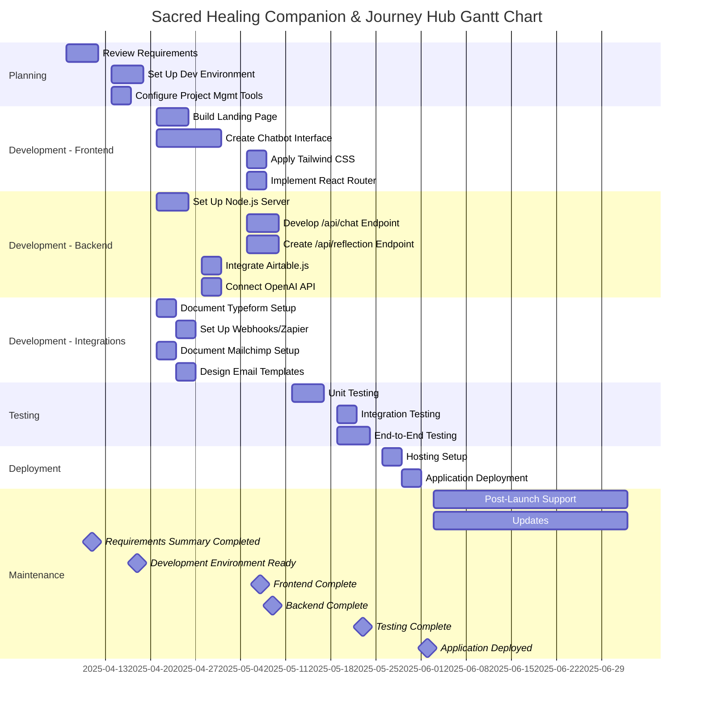

# Gantt Chart for Sacred Healing Companion & Journey Hub

## 1. Introduction

### 1.1 Purpose
This Gantt Chart document provides a detailed and comprehensive timeline for developing the Sacred Healing Companion & Journey Hub, a web-based spiritual wellness platform. The chart visualizes tasks, durations, dependencies, and milestones across all project phases—Planning, Development, Testing, Deployment, and Maintenance—ensuring the AI Coding Agent and development team stay on track to deliver the Minimum Viable Product (MVP) by June 2025. It aligns with the Work Breakdown Structure (WBS), Implementation Plan, Task List, and Tickets documents, supporting the platform’s focus on user privacy, spiritual aesthetic, and integrations with React, Node.js, OpenAI, Airtable, Typeform, and Mailchimp.

### 1.2 Scope
The Gantt chart covers:
- **Planning**: Environment setup and requirements review.
- **Development**: Frontend components, backend APIs, and third-party integrations.
- **Testing**: Unit, integration, and end-to-end tests.
- **Deployment**: Hosting configuration and application launch.
- **Maintenance**: Post-launch monitoring and updates.

The chart spans 12 weeks (April 7, 2025, to June 29, 2025), with ongoing maintenance thereafter. It includes task assignments, dependencies, and milestones to track progress.

### 1.3 Audience
This document is intended for:
- **AI Coding Agent**: To prioritize and execute tasks according to the schedule.
- **Developers**: To coordinate manual tasks and integrate AI-generated code.
- **Project Managers**: To monitor progress and manage resources.
- **Stakeholders**: To understand the project timeline and key deliverables.

### 1.4 Assumptions
- The project starts on April 7, 2025, and aims for MVP completion by June 29, 2025.
- The AI Coding Agent can generate code, tests, and documentation as specified.
- The development team handles manual setups (e.g., Typeform, Mailchimp) in parallel with AI tasks.
- Each week consists of 5 working days, with tasks scheduled to avoid weekends.
- Dependencies are strictly enforced, and tasks may overlap where feasible.

## 2. Gantt Chart Overview
The Gantt chart is organized by project phase, with tasks listed in a table and visualized using Mermaid syntax. Each task includes:
- **Task ID**: Matches the Task List for traceability (e.g., T1.1).
- **Task Name**: Descriptive title from the WBS or Task List.
- **Start Date**: Specific date in 2025.
- **End Date**: Specific date in 2025.
- **Duration**: In days (rounded for simplicity).
- **Dependencies**: Task IDs that must be completed first.
- **Assigned To**: AI Coding Agent, Development Team, or Both.
- **Milestone**: Key deliverables (e.g., “Frontend Complete”).

The chart highlights the critical path—tasks that directly impact the project timeline—and milestones to mark significant progress points.

## 3. Gantt Chart Table
The following table lists all tasks, their schedules, and details. Dates are based on a start date of April 7, 2025, and a 12-week timeline.

| Task ID | Task Name                          | Start Date   | End Date     | Duration (Days) | Dependencies | Assigned To         | Milestone                         |
|---------|------------------------------------|--------------|--------------|-----------------|--------------|---------------------|-----------------------------------|
| T1.1    | Review Requirements                | 2025-04-07   | 2025-04-11   | 5               | None         | AI Coding Agent     | Requirements Summary Completed    |
| T1.2    | Set Up Development Environment     | 2025-04-14   | 2025-04-18   | 5               | T1.1         | AI Coding Agent     | Development Environment Ready     |
| T1.3    | Configure Project Management Tools | 2025-04-14   | 2025-04-16   | 3               | T1.1         | AI Coding Agent     | Trello Board Configured           |
| T2.1.1  | Build Landing Page Component       | 2025-04-21   | 2025-04-25   | 5               | T1.2         | AI Coding Agent     | Landing Page Implemented          |
| T2.1.2  | Create Chatbot Interface           | 2025-04-21   | 2025-05-02   | 10              | T1.2         | AI Coding Agent     | Chatbot Interface Implemented     |
| T2.1.3  | Apply Tailwind CSS                 | 2025-05-05   | 2025-05-07   | 3               | T2.1.1, T2.1.2 | AI Coding Agent     | Consistent Styling Applied        |
| T2.1.4  | Implement React Router             | 2025-05-05   | 2025-05-07   | 3               | T2.1.1, T2.1.2 | AI Coding Agent     | Routing Configured                |
| T2.2.1  | Set Up Node.js Server              | 2025-04-21   | 2025-04-25   | 5               | T1.2         | AI Coding Agent     | Backend Server Initialized        |
| T2.2.2  | Develop /api/chat Endpoint         | 2025-05-05   | 2025-05-09   | 5               | T2.2.1, T2.2.5 | AI Coding Agent     | Chat Endpoint Functional          |
| T2.2.3  | Create /api/reflection Endpoint    | 2025-05-05   | 2025-05-09   | 5               | T2.2.1, T2.2.4 | AI Coding Agent     | Reflection Endpoint Functional    |
| T2.2.4  | Integrate Airtable.js              | 2025-04-28   | 2025-04-30   | 3               | T2.2.1       | AI Coding Agent     | Airtable Integration Complete     |
| T2.2.5  | Connect OpenAI API                 | 2025-04-28   | 2025-04-30   | 3               | T2.2.1       | AI Coding Agent     | OpenAI Integration Complete       |
| T2.3.1  | Document Typeform Setup            | 2025-04-21   | 2025-04-23   | 3               | None         | AI Coding Agent     | Typeform Documentation Complete   |
| T2.3.2  | Set Up Webhooks or Zapier         | 2025-04-24   | 2025-04-28   | 3               | T2.3.1       | AI Coding Agent     | Webhook/Zapier Configured         |
| T2.3.3  | Document Mailchimp Setup           | 2025-04-21   | 2025-04-23   | 3               | T2.3.1       | AI Coding Agent     | Mailchimp Documentation Complete  |
| T2.3.4  | Design Email Templates             | 2025-04-24   | 2025-04-28   | 3               | T2.3.3       | AI Coding Agent     | Email Templates Designed          |
| T3.1    | Unit Testing                       | 2025-05-12   | 2025-05-16   | 5               | T2.1, T2.2   | AI Coding Agent     | Unit Tests Complete (80% Coverage) |
| T3.2    | Integration Testing                | 2025-05-19   | 2025-05-21   | 3               | T3.1         | AI Coding Agent     | Integration Tests Complete        |
| T3.3    | End-to-End Testing                | 2025-05-19   | 2025-05-23   | 5               | T3.1, T3.2   | AI Coding Agent     | End-to-End Tests Complete         |
| T4.1    | Hosting Setup                      | 2025-05-26   | 2025-05-28   | 3               | T3.1–T3.3    | Both                | Vercel Hosting Configured         |
| T4.2    | Application Deployment             | 2025-05-29   | 2025-06-02   | 3               | T4.1         | Both                | Application Deployed              |
| T5.1    | Post-Launch Support                | 2025-06-03   | Ongoing      | Ongoing         | T4.2         | Both                | Monitoring Setup Complete         |
| T5.2    | Updates                            | 2025-06-03   | Ongoing      | Ongoing         | T5.1         | Both                | Update Plan Established           |

## 4. Visual Gantt Chart
The following Mermaid code generates a visual Gantt chart for rendering in compatible tools (e.g., GitHub, Mermaid Live Editor). It reflects the table above, with milestones marked for clarity.

## 5. Critical Path
The critical path—tasks that directly impact the project timeline—includes:
- **T1.1 → T1.2 → T2.1.2 → T3.1 → T3.3 → T4.1 → T4.2**: From requirements review to deployment, focusing on the chatbot interface (T2.1.2) and end-to-end testing (T3.3) as key dependencies.
- Delays in these tasks will push back the MVP launch. Parallel tasks (e.g., T2.3.1–T2.3.4) can mitigate overall delays if prioritized.

## 6. Guidelines for AI Coding Agent
To align with the Gantt chart, the AI Coding Agent must:
- **Follow Schedule**: Start tasks on their designated start dates, prioritizing high-priority tasks (e.g., T2.1.2, T2.2.1).
- **Respect Dependencies**: Only begin tasks after dependencies are complete (e.g., wait for T2.2.1 before T2.2.2).
- **Generate Deliverables**: Produce code, tests, or documentation as specified in the Task List and Tickets documents.
- **Track Milestones**: Ensure deliverables meet milestone criteria (e.g., `ChatbotInterface.tsx` for “Chatbot Interface Implemented”).
- **Adhere to Standards**: Follow Project Rules (camelCase variables, JSDoc comments) and Security Guidelines (HTTPS, input validation, ZDR).
- **Commit Regularly**: Push changes to GitHub with messages referencing task IDs (e.g., `T2.1.2: Implement ChatbotInterface`).
- **Report Progress**: Update task statuses in the project management tool (e.g., Trello) upon completion.

## 7. Resource Allocation
- **AI Coding Agent**: Handles all code generation, test writing, and documentation tasks (T1.1–T3.3, T2.3.1–T2.3.4, T4.1–T4.2, T5.1–T5.2).
- **Development Team**: Assists with manual setups (e.g., Typeform, Mailchimp) and verifies AI-generated outputs during Deployment and Maintenance (T4.1–T5.2).
- **Tools**: GitHub for version control, Vercel for hosting, Trello for task tracking, Sentry for monitoring.

## 8. Risk Management
Potential risks and mitigations:
- **Delayed Dependencies**: Parallelize non-critical tasks (e.g., T2.3.1–T2.3.4) to absorb delays in the critical path.
- **Unclear Custom Prompts**: Use placeholders for OpenAI prompts (T2.2.2, T2.2.5) and update later.
- **Third-Party Issues**: Document manual setup steps clearly (T2.3.1, T2.3.3) and implement retry logic for APIs (T2.2.2, T2.2.3).
- **Testing Failures**: Allocate buffer time in T3.1–T3.3 to address test issues before deployment.

## 9. References
The Gantt chart references the following project documents:
- Product Requirements Document (PRD)
- Software Requirements Specification (SRS)
- App Flow Document
- Features Results Document
- Frontend Guidelines
- Backend Structure Document
- Tech Stack Document
- Security Guidelines
- Work Breakdown Structure (WBS)
- Project Rules Document
- Implementation Plan
- Task List
- Tickets Document
- Directory Structure

## 10. Conclusion
This Gantt Chart document provides a detailed, comprehensive, and complete timeline for developing the Sacred Healing Companion & Journey Hub. By visualizing tasks, dependencies, and milestones, it ensures the AI Coding Agent and development team can deliver a secure, user-focused MVP by June 2025. The chart supports efficient task management, aligns with project requirements, and facilitates the platform’s mission of offering a private, spiritually-aligned healing experience.