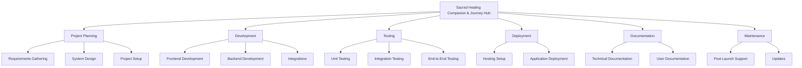

# Work Breakdown Structure (WBS) for Sacred Healing Companion & Journey Hub

## 1. Introduction

### 1.1 Purpose
This Work Breakdown Structure (WBS) document outlines the tasks necessary to develop the Sacred Healing Companion & Journey Hub, a web-based spiritual wellness platform. It serves as a comprehensive guide for project management, ensuring all phases—from planning to maintenance—are systematically addressed, facilitating resource allocation and timeline planning.

### 1.2 Scope
The WBS encompasses the following key phases:
- **Project Planning**: Initial setup, requirements gathering, and system design.
- **Development**: Frontend, backend, and third-party integrations.
- **Testing**: Unit, integration, and end-to-end testing.
- **Deployment**: Hosting configuration and application launch.
- **Documentation**: Technical and user-facing documentation.
- **Maintenance**: Ongoing support and updates post-launch.

### 1.3 Audience
This document targets:
- **Project Managers**: For tracking progress and managing resources.
- **Developers**: To understand task assignments and dependencies.
- **Stakeholders**: To provide visibility into the project’s structure and timeline.

## 2. WBS Hierarchy

The WBS is structured hierarchically, breaking down the project into manageable tasks and sub-tasks under each major phase.

### 2.1 Project Planning
- **Task 1.1**: Requirements Gathering
  - **Sub-task 1.1.1**: Review Product Requirements Document (PRD) and Software Requirements Specification (SRS).
  - **Sub-task 1.1.2**: Conduct interviews with stakeholders to clarify needs.
  - **Sub-task 1.1.3**: Finalize functional and non-functional requirements.
- **Task 1.2**: System Design
  - **Sub-task 1.2.1**: Develop wireframes for user interface components.
  - **Sub-task 1.2.2**: Design Airtable database schema for data storage.
  - **Sub-task 1.2.3**: Define API endpoints and data flow architecture.
- **Task 1.3**: Project Setup
  - **Sub-task 1.3.1**: Initialize Git repository on GitHub.
  - **Sub-task 1.3.2**: Configure development environment (e.g., VS Code, ESLint, Prettier).
  - **Sub-task 1.3.3**: Set up project management boards (e.g., Trello, Jira).

### 2.2 Development
- **Task 2.1**: Frontend Development
  - **Sub-task 2.1.1**: Initialize React project using Create React App.
  - **Sub-task 2.1.2**: Build Landing Page component.
  - **Sub-task 2.1.3**: Create Chatbot Interface with input field and consent toggle.
  - **Sub-task 2.1.4**: Apply Tailwind CSS for responsive styling.
  - **Sub-task 2.1.5**: Implement React Router for page navigation.
- **Task 2.2**: Backend Development
  - **Sub-task 2.2.1**: Set up Node.js server with Express.js framework.
  - **Sub-task 2.2.2**: Develop `/api/chat` endpoint for chatbot functionality.
  - **Sub-task 2.2.3**: Create `/api/reflection` endpoint for user reflection submissions.
  - **Sub-task 2.2.4**: Integrate Airtable.js for database operations.
  - **Sub-task 2.2.5**: Connect OpenAI API for generating chatbot responses.
- **Task 2.3**: Integrations
  - **Sub-task 2.3.1**: Configure Typeform for user intake forms.
  - **Sub-task 2.3.2**: Set up webhooks or Zapier for Typeform-to-Airtable and Mailchimp integration.
  - **Sub-task 2.3.3**: Configure Mailchimp for automated email sequences.
  - **Sub-task 2.3.4**: Design email templates for welcome and guidance emails.

### 2.3 Testing
- **Task 3.1**: Unit Testing
  - **Sub-task 3.1.1**: Write Jest tests for frontend React components.
  - **Sub-task 3.1.2**: Develop Jest tests for backend functions and APIs.
- **Task 3.2**: Integration Testing
  - **Sub-task 3.2.1**: Test API interactions with Airtable and OpenAI.
  - **Sub-task 3.2.2**: Validate Typeform-to-Airtable and Mailchimp workflows.
- **Task 3.3**: End-to-End Testing
  - **Sub-task 3.3.1**: Use Cypress to simulate user flows (e.g., onboarding, chatbot use).
  - **Sub-task 3.3.2**: Ensure mobile responsiveness and cross-browser compatibility.

### 2.4 Deployment
- **Task 4.1**: Hosting Setup
  - **Sub-task 4.1.1**: Create Vercel account and link to GitHub repository.
  - **Sub-task 4.1.2**: Define environment variables in Vercel dashboard.
- **Task 4.2**: Application Deployment
  - **Sub-task 4.2.1**: Deploy frontend and backend to Vercel.
  - **Sub-task 4.2.2**: Verify live application functionality post-deployment.

### 2.5 Documentation
- **Task 5.1**: Technical Documentation
  - **Sub-task 5.1.1**: Document API endpoints, including usage examples.
  - **Sub-task 5.1.2**: Write setup and deployment instructions for developers.
- **Task 5.2**: User Documentation
  - **Sub-task 5.2.1**: Create user guide for onboarding and chatbot interaction.
  - **Sub-task 5.2.2**: Develop FAQ and troubleshooting resources.

### 2.6 Maintenance
- **Task 6.1**: Post-Launch Support
  - **Sub-task 6.1.1**: Monitor application performance and error logs.
  - **Sub-task 6.1.2**: Resolve bugs and issues reported by users.
- **Task 6.2**: Updates
  - **Sub-task 6.2.1**: Plan and prioritize future feature enhancements.
  - **Sub-task 6.2.2**: Schedule regular updates for dependencies and security patches.

## 3. WBS Diagram
The WBS can be represented as a hierarchical tree for visual clarity:

## 4. Task Dependencies
The following dependencies dictate the project sequence:
- **Requirements Gathering** must be completed before **System Design**.
- **System Design** must precede **Development**.
- **Development** must conclude before **Testing** begins.
- **Testing** must pass before **Deployment** can occur.
- **Deployment** must be finalized before **Maintenance** starts.

## 5. Resource Allocation
Resources are assigned based on task needs:
- **Developers**: Handle frontend, backend, and integration development.
- **Designers**: Focus on UI/UX design and wireframe creation.
- **Testers**: Perform unit, integration, and end-to-end testing.
- **Project Managers**: Coordinate tasks and communicate with stakeholders.

## 6. Timeline
The estimated timeline for each phase is:
- **Project Planning**: 2 weeks
- **Development**: 6 weeks
- **Testing**: 2 weeks
- **Deployment**: 1 week
- **Documentation**: 1 week (overlaps with development)
- **Maintenance**: Ongoing after launch

**Total Estimated Duration**: 12 weeks

## 7. Conclusion
This WBS provides a detailed and structured plan for developing the Sacred Healing Companion & Journey Hub. By adhering to this breakdown, the project team can efficiently manage tasks, meet deadlines, and deliver a functional spiritual wellness platform that aligns with stakeholder expectations.